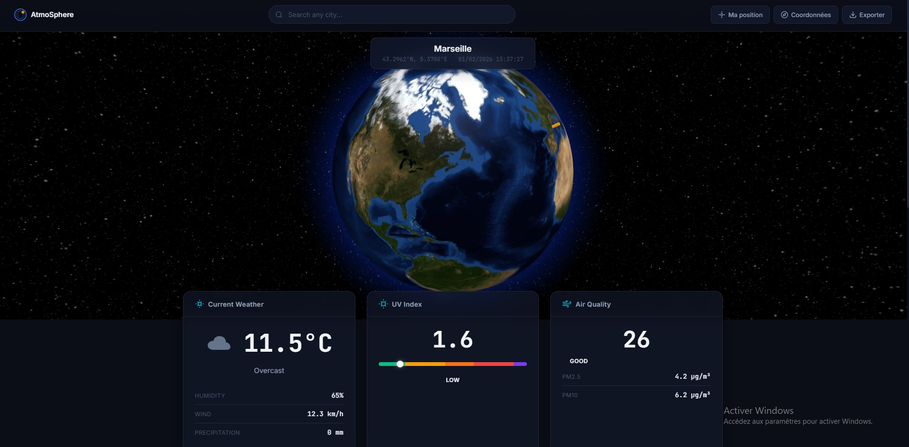
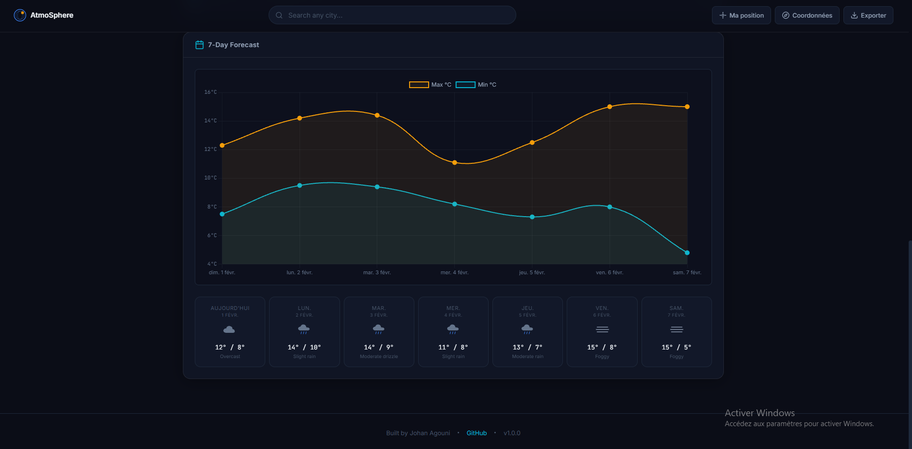
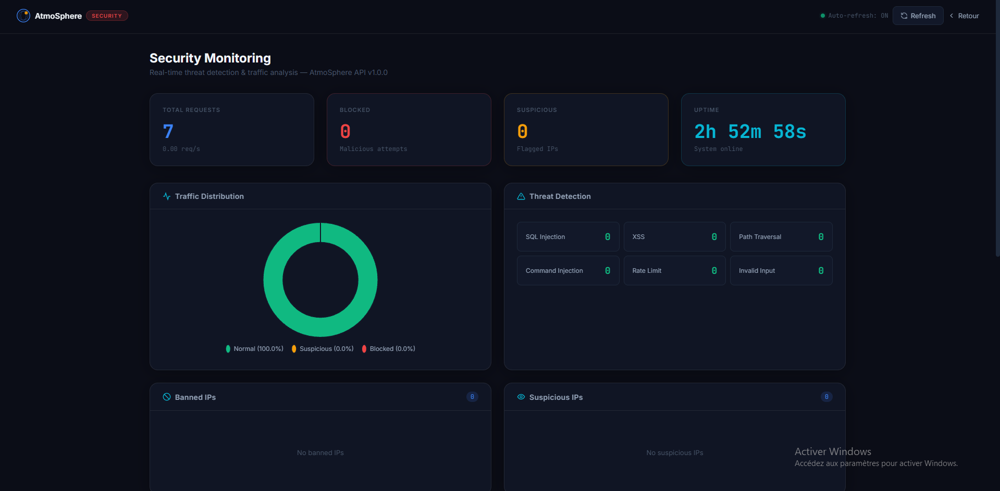

# AtmoSphere

**Dashboard météo interactif avec globe 3D, données temps réel et sécurité applicative**

Visualisation 3D du globe terrestre, données météo en temps réel, indice UV, qualité de l'air et système de sécurité intégré.


### 🌐 [Demo Live](https://atmosphere-dashboard.vercel.app) · 🔗 [API](https://atmosphere-api-production.up.railway.app/health) · 🛡️ [Security Dashboard](https://atmosphere-api-production.up.railway.app/admin/)

---

## Aperçu







---

## Architecture

```
┌──────────────────────┐         ┌──────────────────────┐
│   Frontend (Vercel)  │  fetch  │  Backend (Railway)   │
│                      │ ──────> │                      │
│  Globe.gl + Chart.js │         │  Express + Security  │
│  Static HTML/JS/CSS  │         │  Middleware Stack     │
└──────────────────────┘         └──────┬───────────────┘
                                        │
                         ┌──────────────┼──────────────┐
                         │              │              │
                    Open-Meteo    CurrentUV     Nominatim
                   (météo + air)   (UV index)     (geocoding)
```

| Service | URL | Hébergement |
|---------|-----|-------------|
| Frontend | [atmosphere-dashboard.vercel.app](https://atmosphere-dashboard.vercel.app) | Vercel |
| API Backend | [atmosphere-api-production.up.railway.app](https://atmosphere-api-production.up.railway.app/health) | Railway |
| Security Dashboard | [atmosphere-api-production.up.railway.app/admin/](https://atmosphere-api-production.up.railway.app/admin/) | Railway |

---

## Fonctionnalités

### Dashboard Météo
- **Globe 3D** (Globe.gl) — Cliquez n'importe où sur la Terre pour obtenir la météo
- **Météo en temps réel** — Température, conditions, humidité, vent, précipitations
- **Indice UV** avec barre gradient et niveaux de risque
- **Qualité de l'air** (AQI, PM2.5, PM10) avec recommandations santé
- **Prévisions 7 jours** avec visualisation Chart.js
- **Autocomplétion ville** via Nominatim OpenStreetMap
- **Géolocalisation** intégrée
- **Export de données** (JSON / CSV)

### Sécurité Applicative
- **Helmet** — En-têtes HTTP sécurisés avec CSP strict
- **Bannissement IP** — Protection automatique type fail2ban avec scoring
- **Détection d'attaques** — Injection SQL, XSS, Path Traversal, Injection de commandes
- **Rate Limiting adaptatif** — Protection à 3 niveaux
- **Analyse de patterns** — Détection de comportements de scan
- **Logging Winston** — Logs de sécurité structurés avec rotation quotidienne
- **Dashboard sécurité** — Monitoring des menaces avec authentification Basic Auth

---

## Démarrage rapide

### Prérequis
- Node.js >= 18.0.0

### Installation locale

```bash
git clone https://github.com/Johan-Agouni/atmosphere-api.git
cd atmosphere-api
npm install
cp .env.example .env
npm run dev
```

### Docker

```bash
docker-compose up -d
```

### Accès local

| Page | URL |
|------|-----|
| Dashboard Météo | http://localhost:3000 |
| Dashboard Sécurité | http://localhost:3000/admin/ |
| Health Check | http://localhost:3000/health |

---

## Endpoints API

### Météo

```
GET /api/weather?lat={lat}&lon={lon}    # Météo actuelle
GET /api/forecast?lat={lat}&lon={lon}   # Prévisions 7 jours
GET /health                             # État du serveur
```

### Sécurité (authentification requise)

```
GET  /api/security/stats                # Statistiques globales
GET  /api/security/events?limit=50      # Événements récents
GET  /api/security/banned-ips           # IPs bannies
GET  /api/security/suspicious-ips       # IPs suspectes
POST /api/security/ban                  # Bannir une IP
POST /api/security/unban/:ip            # Débannir une IP
```

---

## Déploiement

Le projet est séparé en deux services :

### Frontend → Vercel
Le dossier `public/` est déployé comme site statique. Le fichier `config.js` contient l'URL de l'API Railway.

### Backend → Railway
Le serveur Express est déployé via le `Dockerfile` multi-stage (Node 18 Alpine, utilisateur non-root, health check).

**Variables d'environnement Railway :**

```bash
NODE_ENV=production
CORS_ORIGIN=https://atmosphere-dashboard.vercel.app
DASHBOARD_USERNAME=admin
DASHBOARD_PASSWORD=<mot_de_passe>
```

---

## Structure du projet

```
atmosphere-api/
├── public/                        # Frontend (Vercel)
│   ├── index.html                 # Dashboard principal (Globe 3D)
│   ├── config.js                  # URL API configurable
│   ├── script.js                  # Globe.gl, autocomplétion, graphiques
│   ├── style.css                  # Thème Dark Observatory
│   └── admin/                     # Dashboard sécurité
├── src/                           # Backend (Railway)
│   ├── server.js                  # Serveur Express
│   ├── controllers/
│   │   └── weatherController.js   # Agrégation des services
│   ├── routes/
│   │   └── weather.js             # Validation des requêtes
│   ├── services/                  # Intégrations API externes
│   │   ├── openMeteoService.js
│   │   ├── uvIndexService.js
│   │   ├── airQualityService.js
│   │   └── forecastService.js
│   ├── utils/
│   │   ├── cache.js               # Cache en mémoire (node-cache)
│   │   ├── validator.js
│   │   └── weatherCodes.js
│   └── security/
│       ├── middleware/             # Pipeline sécurité
│       ├── monitoring/            # Analytics + logging
│       ├── routes/                # Endpoints sécurité
│       └── utils/                 # Scoring des menaces
├── tests/                         # 52 tests (Jest + Supertest)
├── Dockerfile                     # Multi-stage build
├── docker-compose.yml
├── vercel.json                    # Config déploiement Vercel
└── .github/workflows/ci.yml      # CI/CD (lint, test, audit)
```

---

## Stack technique

| Couche | Technologies |
|--------|-------------|
| **Backend** | Node.js 18, Express, Helmet, Winston, node-cache |
| **Frontend** | Vanilla JS, Globe.gl, Chart.js, CSS custom properties |
| **APIs externes** | Open-Meteo (météo + air), CurrentUVIndex, Nominatim OSM |
| **Sécurité** | Helmet, express-rate-limit, express-validator, fail2ban-like |
| **Tests** | Jest, Supertest (52 tests) |
| **CI/CD** | GitHub Actions (lint, test, security audit) |
| **DevOps** | Docker multi-stage, Vercel, Railway |

---

## Tests

```bash
npm test                    # 52 tests, 9 suites
npm run test:watch          # Mode watch
npm run lint                # ESLint 9 + Prettier
```

---

## Sécurité

Voir [SECURITY.md](SECURITY.md) pour la documentation complète.

---

## Licence

MIT — voir [LICENSE](LICENSE)

---

## Auteur

**Johan Agouni** — Développeur Web spécialisé en Sécurité Applicative

- GitHub : [@Johan-Agouni](https://github.com/Johan-Agouni)
